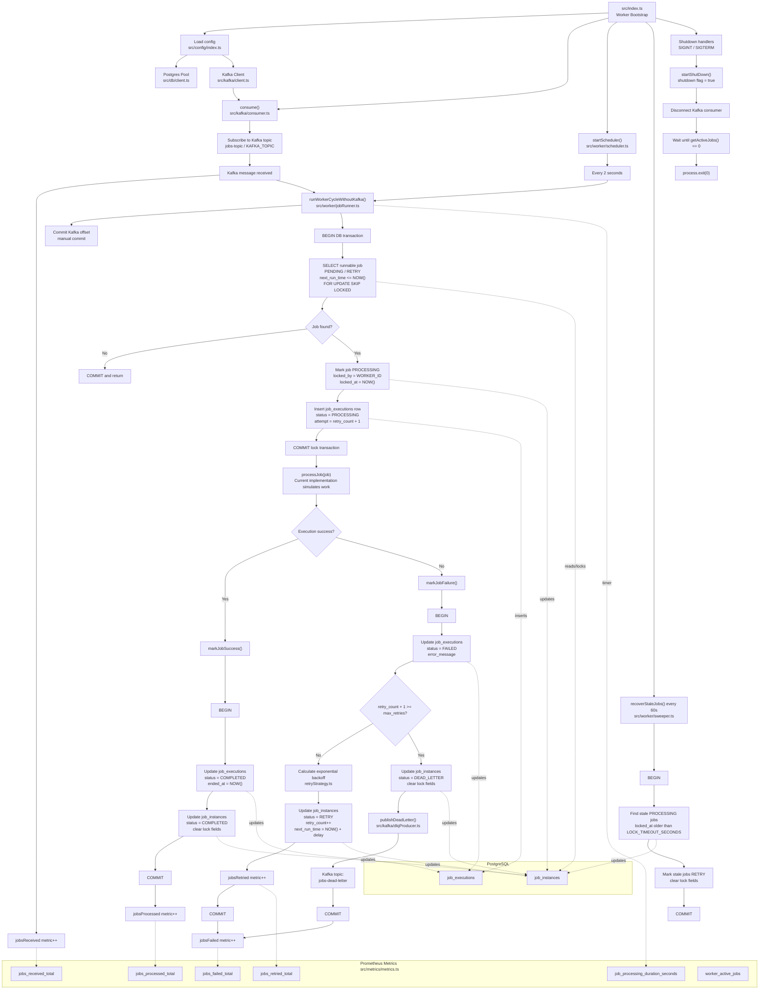
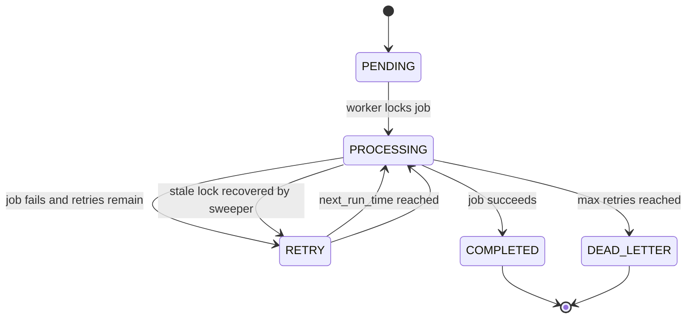

# Distributed Job Scheduler — Job API

This service is the **entry point of the Distributed Job Scheduler system**.
It is responsible for:

* Creating job definitions
* Scheduling job instances
* Publishing jobs to Kafka
* Ensuring idempotent job creation
* Applying rate limiting
* Persisting jobs into PostgreSQL

The API acts as the **producer layer** in the system.

---

# 🧠 System Overview

This project demonstrates how modern distributed job schedulers work internally.

Architecture:

Client → Job API → PostgreSQL → Kafka → Worker Nodes

---

# HLD

---

# ⚙️ Tech Stack

Node.js
TypeScript
Express.js
PostgreSQL
Kafka
Redis (Rate Limiting)
Prometheus (Metrics)
Docker

---

# 🏗 High Level Architecture

The Job API is responsible for **reliably accepting jobs and publishing them to Kafka**.

Flow:

1. Client creates job definition
2. Client schedules job instance
3. API stores job in PostgreSQL
4. API publishes job event to Kafka
5. Workers consume the job

This architecture ensures:

* Decoupled workers
* Horizontal scaling
* Reliable retry mechanisms

---

# 🚀 API Endpoints

## Create Job Definition

POST /job-definitions

Example request:

{
"name": "send_email",
"job_type": "email",
"cron_expression": null
}

---

## Schedule Job

POST /jobs

Example request:

{
"job_def_id": "UUID",
"idempotency_key": "email-user-123",
"payload": {
"email": "[user@test.com](mailto:user@test.com)"
},
"next_run_time": "2026-03-17T10:00:00Z"
}

---

## Get Job Status

GET /job/:id

Returns job state and retry information.

---

# 🔁 Idempotency Support

Jobs include an **idempotency key**.

This prevents duplicate jobs when:

* API retries happen
* client retries requests
* network failures occur

Unique constraint:

(job_def_id, idempotency_key)

---

# ⚡ Rate Limiting

Rate limiting is implemented using Redis.

This protects the API from:

* abuse
* job floods
* accidental high load

---

# 📊 Observability

Metrics are exposed for Prometheus.

Example metrics:

jobs_created_total
jobs_failed_total
api_request_duration_seconds

Metrics endpoint:

/metrics

---

# 🐳 Running Locally

Start infrastructure:

docker-compose up -d

Services started:

PostgreSQL
Kafka
Redis
Prometheus
Grafana

---

# ▶ Run API

npm install
npm run dev

Server runs on:

http://localhost:8000

---

# 🔐 Reliability Guarantees

The system guarantees:

* Idempotent job creation
* Reliable event publishing
* Safe retries
* Horizontal scaling

---

# 📌 Future Improvements

Outbox Pattern for Kafka reliability
Distributed cron scheduling
Workflow orchestration
Job priority queues

---

# 👨‍💻 Author

Built as a distributed systems project demonstrating production-grade backend architecture.
