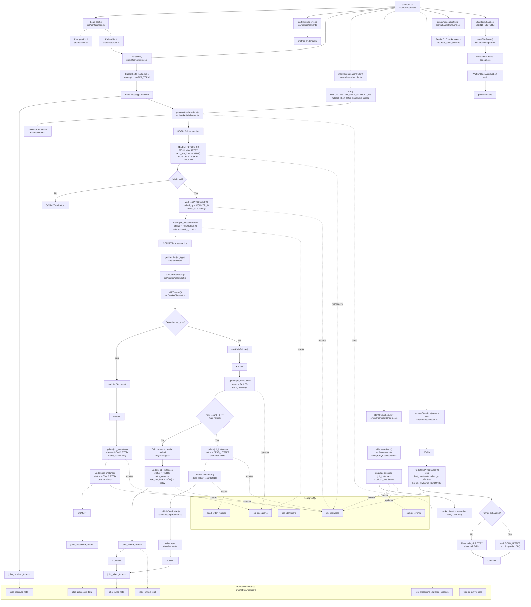
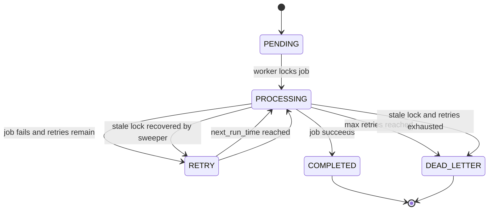

# Distributed Job Scheduler — Job Worker

This service is the **execution layer** of the Distributed Job Scheduler system. It is responsible for:

* Consuming job-dispatch events from Kafka
* Claiming runnable jobs from PostgreSQL (`PENDING` / `RETRY`)
* Executing jobs via pluggable handlers (`email`, `webhook`, `sleep`, and a default fallback)
* Retrying failed jobs with exponential backoff
* Publishing and persisting dead-letter records
* Recovering stale locks from crashed workers
* Running leader-elected cron scheduling for recurring job definitions
* Exposing Prometheus metrics and a health endpoint

The worker acts as the **consumer/processor layer** in the system.

---

# System Overview

This project demonstrates how distributed job schedulers execute work reliably at scale.

Architecture:

```
Client → Job API → PostgreSQL + Kafka → Worker Node(s) → Handlers / DLQ
```

Multiple worker instances can run in parallel. Job claiming uses `FOR UPDATE SKIP LOCKED` so workers do not double-process the same job.

---

# HLD





---

# Tech Stack

* Node.js
* TypeScript
* PostgreSQL
* Kafka (KafkaJS)
* Prometheus (`prom-client`)
* Docker (Kafka, Prometheus, Grafana)

---

# High Level Architecture

The worker coordinates three dispatch paths:

1. **Kafka consumer (primary)** — each message triggers `processAvailableJobs()` to claim and run work.
2. **Reconciliation poller (fallback)** — periodically polls the database for runnable jobs missed by Kafka (for example, outbox relay delay or broker hiccup).
3. **Cron scheduler (leader-elected)** — one worker acquires a PostgreSQL advisory lock and enqueues due cron job instances plus outbox events.

Execution flow:

1. Job API stores a job instance in PostgreSQL and publishes a dispatch event to Kafka.
2. A worker receives the Kafka event and claims the next runnable job.
3. The worker runs the matching handler under a timeout with periodic heartbeats.
4. On success, the job is marked `COMPLETED`. On failure, it is retried with backoff or moved to `DEAD_LETTER`.
5. A sweeper recovers jobs left in `PROCESSING` after worker crashes.

This architecture ensures:

* Decoupled, horizontally scalable workers
* At-least-once dispatch with database reconciliation
* Safe retries, heartbeats, and stale-lock recovery
* Observable execution via Prometheus

---

# Job Handlers

Handlers live in `src/handlers/` and are selected by `job_type` from `job_definitions`.

| `job_type` | Handler | Required payload |
|------------|---------|------------------|
| `email` | `emailHandler` | `{ "email": "user@example.com" }` |
| `webhook` | `webhookHandler` | `{ "url": "https://...", "body": {} }` |
| `sleep` | `sleepHandler` | `{ "duration_ms": 1000 }` (optional, default 1000) |
| anything else | `defaultHandler` | any JSON payload |

Per-job timeout comes from `job_definitions.timeout_seconds`, falling back to `DEFAULT_JOB_TIMEOUT_SECONDS` (default 60).

---

# Concurrency and Reliability

* **Worker concurrency** — `WORKER_CONCURRENCY` caps how many jobs a single process runs at once (default 5).
* **Heartbeats** — while a job runs, `last_heartbeat` is updated on a fixed interval so the sweeper can distinguish live work from crashed workers.
* **Timeouts** — handlers are wrapped in `withTimeout()`; exceeded jobs fail and enter the retry/DLQ path.
* **Stale recovery** — every 60 seconds, jobs in `PROCESSING` with an expired heartbeat/lock are moved to `RETRY` or `DEAD_LETTER`.
* **Graceful shutdown** — on `SIGINT`/`SIGTERM`, the worker stops accepting new Kafka work and waits for in-flight jobs to finish.
* **Dead letters** — terminal failures are written to `dead_letter_records` and published to the DLQ Kafka topic; a dedicated DLQ consumer persists inbound DLQ events as well.

---

# Cron Scheduling

The cron scheduler (`src/worker/cronScheduler.ts`):

* Runs on a configurable tick interval (`CRON_TICK_INTERVAL_MS`, default 60s).
* Uses `withLeaderLock()` so only one worker enqueues cron jobs at a time.
* Reads active `job_definitions` with a `cron_expression`.
* Creates idempotent `job_instances` keyed by `cron-{jobDefId}-{minute-bucket}`.
* Inserts an `outbox_events` row so the Job API relay can publish to Kafka.

---

# Observability

Metrics are exposed on a dedicated HTTP server (not the Job API).

| Endpoint | Purpose |
|----------|---------|
| `GET /metrics` | Prometheus scrape target |
| `GET /health` | Liveness check (`{ "status": "ok" }`) |

Metrics:

* `jobs_received_total`
* `jobs_processed_total`
* `jobs_failed_total`
* `jobs_retried_total`
* `job_processing_duration_seconds`
* `worker_active_jobs`
* Default Node.js process metrics via `prom-client`

Default metrics port: `4000` (`METRICS_PORT`).

---

# Environment Variables

| Variable | Description |
|----------|-------------|
| `DB_HOST`, `DB_PORT`, `DB_NAME`, `DB_USER`, `DB_PASSWORD` | PostgreSQL connection |
| `WORKER_ID` | Unique identifier stored in `locked_by` / `worker_id` |
| `KAFKA_BROKER` | Kafka broker address |
| `KAFKA_TOPIC` | Dispatch topic (default `jobs-topic`) |
| `KAFKA_GROUP_ID` | Consumer group (default `job-workers`) |
| `KAFKA_DLQ_TOPIC` | Dead-letter topic (default `jobs-dead-letter`) |
| `WORKER_CONCURRENCY` | Max concurrent jobs per process (default `5`) |
| `POLL_INTERVAL_MS` | Legacy poll interval fallback |
| `RECONCILIATION_POLL_INTERVAL_MS` | Fallback DB poll interval (default `30000`) |
| `CRON_TICK_INTERVAL_MS` | Cron scheduler tick (default `60000`) |
| `HEARTBEAT_INTERVAL_MS` | Job heartbeat interval (default `5000`) |
| `LOCK_TIMEOUT_SECONDS` | Stale lock threshold for sweeper |
| `BASE_RETRY_DELAY_SECONDS` | Base delay for exponential backoff |
| `DEFAULT_JOB_TIMEOUT_SECONDS` | Handler timeout fallback (default `60`) |
| `LEADER_LOCK_KEY` | PostgreSQL advisory lock key for cron leader election |
| `METRICS_PORT` | Metrics/health server port (default `4000`) |
| `DB_MAX_CONNECTIONS`, `DB_IDLE_TIMEOUT_MS`, `DB_CONNECTION_TIMEOUT_MS` | Pool tuning |

---

# Running Locally

## Start infrastructure

```bash
docker-compose up -d
```

Services started by this compose file:

* Zookeeper
* Kafka
* Prometheus
* Grafana

PostgreSQL is expected to be available separately (typically from the parent Job API / shared stack).

## Run the worker

```bash
npm install
npm run dev
```

The worker process starts Kafka consumers, the reconciliation poller, cron scheduler, sweeper, and metrics server.

Metrics and health:

* `http://localhost:4000/metrics`
* `http://localhost:4000/health`

Prometheus UI: `http://localhost:9090`  
Grafana UI: `http://localhost:3000`

---

# Reliability Guarantees

The worker provides:

* Safe concurrent claiming via row-level locks
* At-least-once execution with idempotent cron enqueue keys
* Exponential backoff retries
* Crash recovery through heartbeats and the sweeper
* Dead-letter persistence and Kafka notification
* Graceful shutdown without abandoning in-flight work

---

# Future Improvements

* Workflow orchestration and job dependencies
* Job priority queues
* Handler sandboxing / external worker plugins
* Smarter reconciliation backoff instead of fixed polling

---

# Author

Built as a distributed systems project demonstrating production-grade backend architecture.
